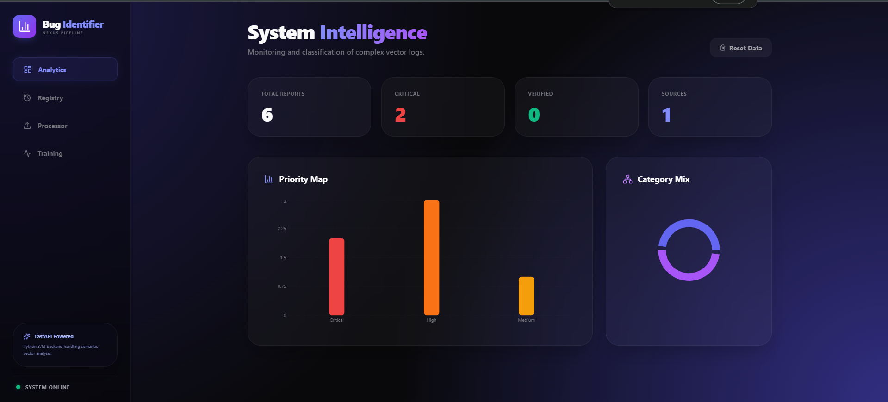

# 🔍 Bug Identifier: Nexus NLP Pipeline

[](https://fastapi.tiangolo.com/)
[](https://reactjs.org/)
[](https://ai.google.dev/)
[](https://tailwindcss.com/)

**Bug Identifier** is an advanced, AI-powered log processing and architectural audit system. It leverages the **Nexus Pipeline** to vectorize raw log data and perform deep semantic analysis using Google's Gemini 1.5 Flash. The system is designed to identify, categorize, and prioritize system failures, security threats, and performance bottlenecks in real-time.

---

## 🚀 Dashboard Overview



---

## ✨ Key Features

- **🧠 Hybrid Intelligence**: Combines the reasoning power of Gemini 1.5 Flash with a local **Random Forest Classifier** (Scikit-Learn) for offline classification fallback.
- **🛡️ Nexus Pipeline**: Sophisticated data ingestion layer that processes `.log`, `.pcap`, `.csv`, and `.txt` files into actionable vectors.
- **📊 Real-time Analytics**: High-fidelity dashboard featuring **Priority Maps** and **Category Mix** distributions using Recharts and Plotly.
- **🎓 Training Center**: Self-learning feedback loop where verified bug reports are used to fine-tune the local classification model.
- **📄 Audit Reporting**: One-click **PDF Export** for generating professional audit reports and registry summaries.

---

## 🛠️ Tech Stack

### Backend
- **Core**: Python 3.x, FastAPI
- **NLP/AI**: Google Generative AI (Gemini), Scikit-Learn
- **Data**: SQLite3, Pandas, Joblib
- **Export**: FPDF

### Frontend
- **Framework**: React 18, Vite, TypeScript
- **Styling**: Tailwind CSS (Glassmorphism design system)
- **Charts**: Recharts, Lucide Icons
- **HTTP**: Axios

---

## ⚙️ Installation & Setup

### 1. Prerequisites
- Python 3.10+
- Node.js 18+
- Google Gemini API Key

### 2. Backend Configuration
```bash
# Clone the repository
git clone https://github.com/Rajan3103/nlp-log-processor-and-bug-reporter.git
cd nlp-log-processor-and-bug-reporter

# Install Python dependencies
pip install -r requirements.txt

# Create .env.local and add your key
echo "GEMINI_API_KEY=your_api_key_here" > .env.local

# Start the FastAPI server
python main.py
```

### 3. Frontend Configuration
```bash
cd client

# Install NPM dependencies
npm install

# Start the development server
npm run dev
```

---

## 📖 How It Works

1.  **Ingestion**: Upload a log file (e.g., `sample.log`) through the **Processor** tab.
2.  **Analysis**: The Nexus Pipeline vectorizes the content and sends it to the Gemini Engine for semantic classification.
3.  **Audit**: Review identified issues in the **Registry**. You can verify reports to improve the local model's accuracy.
4.  **Training**: Visit the **Training Center** to rebuild the local Random Forest model once you have enough verified data.

---

## 🤝 Contributing
Contributions are welcome! Please feel free to submit a Pull Request or open an issue for any bugs or feature requests.

## 📄 License
Distributed under the MIT License. See `LICENSE` for more information.
